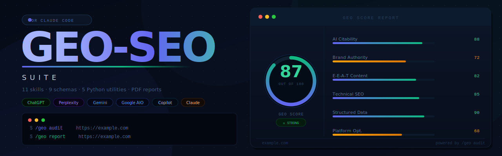

<p align="center">
  
</p>

<p align="center">
  <a href="https://github.com/aromeni/geo-seo-suite-claude/blob/main/LICENSE"></a>
  
  
  
</p>

<p align="center">
  <strong>GEO-first, SEO-supported.</strong> Optimize websites for AI-powered search engines —<br/>
  ChatGPT, Claude, Perplexity, Gemini, and Google AI Overviews — while maintaining traditional SEO foundations.
</p>

<p align="center">
  AI search is eating traditional search. This tool optimizes for where traffic is going, not where it was.
</p>

---

## Table of Contents

- [Why GEO Matters](#why-geo-matters-2026)
- [Quick Start](#quick-start)
- [Commands](#commands)
- [Architecture](#architecture)
- [How It Works](#how-it-works)
- [Key Features](#key-features)
- [Use Cases](#use-cases)
- [Uninstall](#uninstall)
- [Contributing](#contributing)

---

## Why GEO Matters (2026)

| Metric | Value |
|--------|-------|
| GEO services market | $850M+ (projected $7.3B by 2031) |
| AI-referred traffic growth | +527% year-over-year |
| AI traffic conversion rate vs organic | 4.4× higher |
| Gartner: traditional search traffic drop by 2028 | −50% |
| Brand mentions vs backlinks for AI visibility | 3× stronger correlation |
| Marketers currently investing in GEO | Only 23% |

---

## Quick Start

### One-Command Install (macOS / Linux)

```bash
bash <(curl -fsSL https://raw.githubusercontent.com/aromeni/geo-seo-suite-claude/main/install.sh)
```

### Manual Install

```bash
git clone https://github.com/aromeni/geo-seo-suite-claude.git
cd geo-seo-suite-claude
./install.sh
```

### Requirements

- [Claude Code CLI](https://github.com/anthropics/claude-code) (`npm install -g @anthropic-ai/claude-code`)
- Python 3.8+
- Git

### After Install

Open any Claude Code session and run your first audit:

```
/geo audit https://your-site.com
```

Output files (`GEO-AUDIT-REPORT.md`, `GEO-CLIENT-REPORT.md`, etc.) are written to your **current working directory**.

---

## Commands

Type these directly into any Claude Code session:

| Command | What It Does |
|---------|-------------|
| `/geo audit <url>` | Full GEO + SEO audit with parallel subagents |
| `/geo quick <url>` | 60-second GEO visibility snapshot |
| `/geo citability <url>` | Score content for AI citation readiness |
| `/geo crawlers <url>` | Check AI crawler access (robots.txt) |
| `/geo llmstxt <url>` | Analyze or generate llms.txt |
| `/geo brands <url>` | Scan brand mentions across AI-cited platforms |
| `/geo platforms <url>` | Platform-specific optimization |
| `/geo schema <url>` | Structured data analysis & generation |
| `/geo technical <url>` | Technical SEO audit |
| `/geo content <url>` | Content quality & E-E-A-T assessment |
| `/geo report <url>` | Generate client-ready GEO report |
| `/geo report-pdf` | Generate professional PDF report with charts |

---

## Architecture

```
geo-seo-suite-claude/
├── geo/                          # Main skill orchestrator
│   └── SKILL.md                  # Primary skill file with commands & routing
├── skills/                       # 11 specialized sub-skills
│   ├── geo-audit/                # Full audit orchestration & scoring
│   ├── geo-citability/           # AI citation readiness scoring
│   ├── geo-crawlers/             # AI crawler access analysis
│   ├── geo-llmstxt/              # llms.txt standard analysis & generation
│   ├── geo-brand-mentions/       # Brand presence on AI-cited platforms
│   ├── geo-platform-optimizer/   # Platform-specific AI search optimization
│   ├── geo-schema/               # Structured data for AI discoverability
│   ├── geo-technical/            # Technical SEO foundations
│   ├── geo-content/              # Content quality & E-E-A-T
│   ├── geo-report/               # Client-ready markdown report generation
│   └── geo-report-pdf/           # Professional PDF report with charts
├── agents/                       # 5 parallel subagents
│   ├── geo-ai-visibility.md      # GEO audit, citability, crawlers, brands
│   ├── geo-platform-analysis.md  # Platform-specific optimization
│   ├── geo-technical.md          # Technical SEO analysis
│   ├── geo-content.md            # Content & E-E-A-T analysis
│   └── geo-schema.md             # Schema markup analysis
├── scripts/                      # Python utilities
│   ├── fetch_page.py             # Page fetching & parsing
│   ├── citability_scorer.py      # AI citability scoring engine
│   ├── brand_scanner.py          # Brand mention detection
│   ├── llmstxt_generator.py      # llms.txt validation & generation
│   └── generate_pdf_report.py    # PDF report generator (ReportLab)
├── schema/                       # JSON-LD schema templates
│   ├── organization.json         # Organization schema with sameAs
│   ├── local-business.json       # LocalBusiness schema
│   ├── article-author.json       # Article + Person schema (E-E-A-T)
│   ├── software-saas.json        # SoftwareApplication schema
│   ├── product-ecommerce.json    # Product schema with offers
│   ├── website-searchaction.json # WebSite + SearchAction schema
│   ├── faq-page.json             # FAQPage schema (AI Q&A extraction)
│   ├── person-brand.json         # Person schema (personal brands)
│   └── breadcrumb-list.json      # BreadcrumbList schema
├── images/                       # Repository assets
│   └── banner.svg                # Repository banner
├── install.sh                    # One-command installer
├── uninstall.sh                  # Uninstaller
└── requirements.txt              # Python dependencies
```

---

## How It Works

### Full Audit Flow

When you run `/geo audit https://example.com`:

1. **Discovery** — Fetches homepage, detects business type, crawls sitemap
2. **Parallel Analysis** — Launches 5 subagents simultaneously:
   - AI Visibility (citability, crawlers, llms.txt, brand mentions)
   - Platform Analysis (ChatGPT, Perplexity, Google AIO readiness)
   - Technical SEO (Core Web Vitals, SSR, security, mobile)
   - Content Quality (E-E-A-T, readability, freshness)
   - Schema Markup (detection, validation, generation)
3. **Synthesis** — Aggregates scores into a composite GEO Score (0–100)
4. **Report** — Outputs prioritized action plan with quick wins and business impact estimates

### Scoring Methodology

| Category | Weight |
|----------|--------|
| AI Citability & Visibility | 25% |
| Brand Authority Signals | 20% |
| Content Quality & E-E-A-T | 20% |
| Technical Foundations | 15% |
| Structured Data | 10% |
| Platform Optimization | 10% |

---

## Key Features

### Citability Scoring
Analyzes content blocks for AI citation readiness. Optimal AI-cited passages are 134–167 words, self-contained, fact-rich, and directly answer questions.

### AI Crawler Analysis
Checks robots.txt for 14+ AI crawlers (GPTBot, ClaudeBot, PerplexityBot, Bingbot, Google-Extended, etc.) and provides specific allow/block recommendations per platform.

### Brand Mention Scanning
Brand mentions correlate 3× more strongly with AI visibility than backlinks. Scans YouTube, Reddit, Wikipedia, LinkedIn, Crunchbase, GitHub, and 7+ other platforms.

### Platform-Specific Optimization
Only 11% of domains are cited by both ChatGPT and Google AI Overviews for the same query. Provides tailored recommendations per platform with specific implementation steps.

### llms.txt Generation
Generates the emerging llms.txt standard file that tells AI crawlers what your site is about and which pages matter most — similar to robots.txt but for AI comprehension.

### Schema Templates
9 ready-to-use JSON-LD schema templates covering Organization, LocalBusiness, Article + Author, SoftwareApplication, Product, WebSite, FAQPage, Person, and BreadcrumbList — all pre-populated with the GEO-specific properties that improve AI entity recognition.

### Client-Ready Reports
Generates professional GEO reports in Markdown or PDF. PDF reports include score gauges, bar charts, platform readiness visualizations, colour-coded tables, and a prioritized action plan — ready to deliver directly to clients.

---

## Use Cases

- **GEO Agencies** — Run client audits and generate polished deliverables in minutes
- **Marketing Teams** — Monitor and improve AI search visibility across all major platforms
- **Content Creators** — Optimize individual articles and pages for AI citations
- **Local Businesses** — Get discovered by AI assistants answering local queries
- **SaaS Companies** — Build entity recognition across ChatGPT, Gemini, and Perplexity
- **E-commerce** — Optimize product pages for AI shopping recommendations

---

## Uninstall

```bash
./uninstall.sh
```

Or manually remove the installed files:

```bash
rm -rf ~/.claude/skills/geo ~/.claude/skills/geo-* ~/.claude/agents/geo-*.md
```

---

## Contributing

Contributions are welcome.

- **Bug reports / feature requests** — open an [issue](https://github.com/aromeni/geo-seo-suite-claude/issues)
- **Pull requests** — please open an issue to discuss the change first
- **New schema templates** — add to `schema/` and reference in `skills/geo-schema/SKILL.md`
- **New skills** — follow the existing `SKILL.md` frontmatter format and register the command in `geo/SKILL.md`

---

## License

MIT — see [LICENSE](LICENSE) for details.

---

<p align="center">
  <a href="https://github.com/aromeni/geo-seo-suite-claude">github.com/aromeni/geo-seo-suite-claude</a> · Built for the AI search era.
</p>
